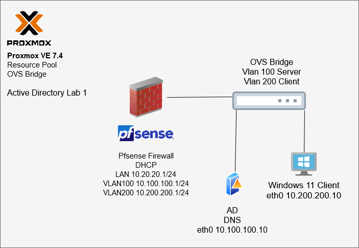

# AD-Labs overview
This is a collection of active directory labs conducted in a virtual environment hosted in a hyperconverged Proxmox VE cluster. 

---
# Lab Compontents
- Proxmox VE 7.4 Host
  - OVS Bridge
  - OVS IntPort VLAN100 VLAN200
- Firewall Pfsense
- Server Windows Server 2022
- Client Windows Enterprise 11

# lab topology

 

