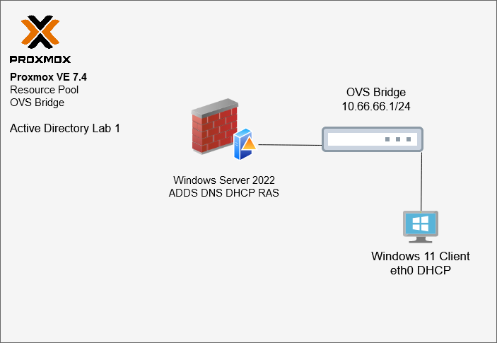

# AD-Labs Overview
This is an active directory lab conducted in a hyperconverged Proxmox VE cluster. 

The scripts in this repo will facilitate an ADDS lab with users who decided to make poor password choices. 

---
# Lab Compontents & Requirements
- Proxmox VE 7.4 Host
  - OVS Bridge
  - OVS IntPort
- Server: Windows Server 2022
- Client: Windows Enterprise 11

# Lab Topology


 Proxmox VE is used to host both client and server under an OVS bridge and OVS intport

The Domain controller acts as ADDS, DNS, DHCP, RAS server.  

## Setup Instructions

Run the script below to install required lab services.

```
Start-Process powershell -Verb RunAs -ArgumentList "Install-WindowsFeature -Name AD-Domain-Services, DNS, RemoteAccess, DHCP -IncludeManagementTools -Restart"
```
Run the deployment scripts in the following order:
  1. lab1-create-forest.ps1
  2. lab1-create-users.ps1

## To Do:
  - Review and improve deployment scripts, README
    - DHCP configuration via powershell
    - RAS configuration via powershell
  - GUI
  - Output file for "lab key"


## Credits

Many hours have been poured into how to create this repo. Github has been a learning experience and I want to thank the folks that unkownly assisted and inspired me to challenge myself. A big thank you, you have been instrumental my success. 

https://github.com/johnhammond
https://github.com/joshmadakor1